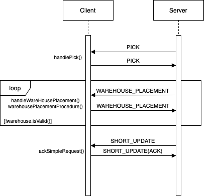
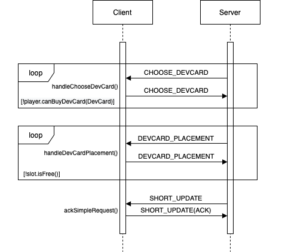
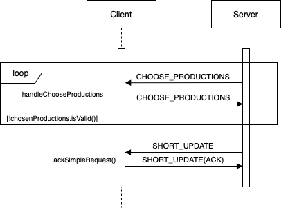
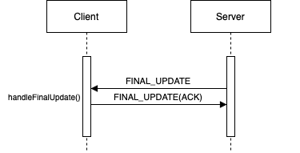

# Sequence diagram & messages

## Client-Server messages

Each message has a type and a payload. The server sends a message of a certain type and the client answers with a new message of the same type, with the desired response in the payload. 

The following table describes each type of message and the content of its payload.

| Type | Server | Client |
|------|--------|--------|
|FIRST_MESSAGE|---|First message sent by the client to start the communication|
|REGISTRATION_MESSAGE|Request of username at start of connection|Username|
|WELCOME_MESSAGE|Welcome message with first instructions|Create/join lobby|
|NUMBER_OF_PLAYERS|Request of the size of the lobby|Lobby size (number of players)
|JOIN_GAME|Request of the lobby id|Lobby id|
|RECONNECTION_MESSAGE|Check whether the player wants to reconnect to his previous game|The player's choice|
|QUIT_MESSAGE|---|Closes the connection to the client|
||**GAME MESSAGES**||
|START_GAME_COMMAND|Request to start the game when all the players have joined|The command to start the game|
|CHOOSE_DEVCARD|The development card structure|The development card to buy|
|CHOOSE_PRODUCTION|List of possible production(s)|The production(s) to activate|
|CHOOSE_START_LEADERS|Four leader cards drafted at the start of the game|Selection of two leader cards|
|CHOOSE_START_RESOURCES|Amount of resources to choose at the start of the game|Selected resources and their placement|
|LEADER_ACTIVATION|Check if the player wants to perform a leader card action|True or false|
|LEADER_ACTION|Selection of possible leader cards to play/discard|Selected leader card and the action to perform (activate/discard)|
|MAIN_CHOICE|Request to choose an action between the three main actions|Main action of the turn|
|PICK|Market structure|Selected line/column of the market|
|WAREHOUSE_PLACEMENT|Placement of the resources in the warehouse|Resources to place in the warehouse|
|DEVCARD_PLACEMENT|Development card to place in the structure|Positioning of the dev card
|COME_BACK|| Request to go back to the previous choice.
|SHORT_UPDATE|Short text message summarizing the progress of the game| ---
|UPDATE|Complete update of the game's components|---
|RECONNECTION_UPDATE|Complete update of the game's components after the reconnection|---
|FINAL_UPDATE|Game results and rankings at the end of the match|---

_Note: more messages could be added in the future._

---

## Sequence diagrams

The following diagrams aim to describe each Client-Server interaction.

_Note: whenever the player enters a loop, there will always be the possibility of a COMEBACK message to break the loop
and return to the last choice before entering the loop (e.g. a player chose to buy a development card but has no 
resources to do so)._

### - Game creation

### - Join game

### - Game preparation

### - Start of player turn

### - Taking resources from market

### - Buying a development card

### - Activation of production(s)

### - End of player turn

### - End of game

